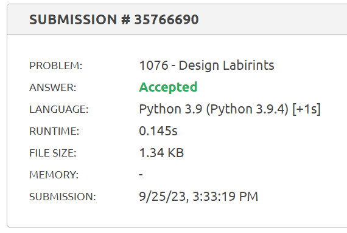

# Design Labirints #
_beecrowd | 1076_

[Design Labirints](https://www.beecrowd.com.br/judge/en/problems/view/1076)

## Descrição ##
Peter loves to draw mazes, and recently he had an idea: which would be the minimum of pen movements needed to draw a maze, always beginning and finishing at the same position? To make the game more interesting, Peter decided that it is not allowed to lift the pen from the paper. The templates for construction of the maze are always square, 3 x 3, 4 x 4, 5 x 5 up to a maximum of 7 x 7.

For each example, Peter will specify where the drawing must start and your task is to determine the amount of movements required to draw the Peter's maze. Peter remembers that you do not have to worry about cycles, because there will be no cycles in any of the test cases. However, a test case can have an input 4 1 and another input 1 4. This means two lines connecting these same two nodes. Anyway it will make no difference in the drawing of the labyrinth because the amount of movement should be the same.

See the examples below, In the maze(4 x 4), Peter wants to begin in the node 0, draw all lines and return to node 0. For this, the minimum of possible moves is 30. In the maze B (3 x 3), Pedro begins in the node 1, draws all lines and returns to node 1. In this case, he needs 10 movements to make this drawing.

### Entrada ### 
The first input line contains an integer T (T < 100) that represents the number of test cases. Each test case begin with a line containing an integer N ( N < X2, where X is the size of the maze that can be from 3 up to 7). This N is the node where the drawing must start and also finish. In the next input line there are two informationsV and A that respectively represents the amount of vertices and edges of the maze. Follow A lines, each one indicating a line segment that Peter must plot to draw the desired maze.

Input Sample
```
2
0
16 15
0 4
2 3
6 2
8 9
10 9
8 12
14 15
14 10
6 5
10 11
11 7
4 8
0 1
1 2
12 13
1
9 6
1 2
1 4
4 7
7 8
4 1
4 3
```

### Saída ###
The output should contain one integer for each test case. This number is the amount of movement of pen that must be made to draw the desired maze, considering that the start and end are always from the same point (node) that can not lift the pen from the paper.

Output Sample
```
30
10
```

## Resultado ##




